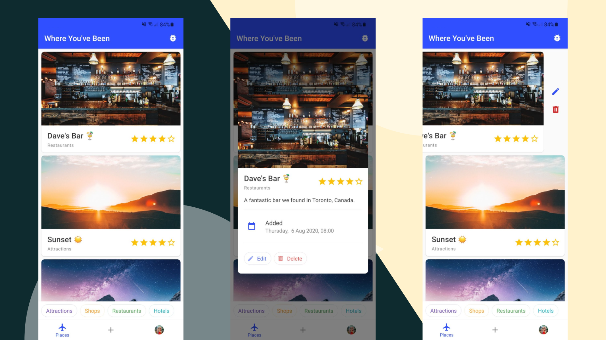
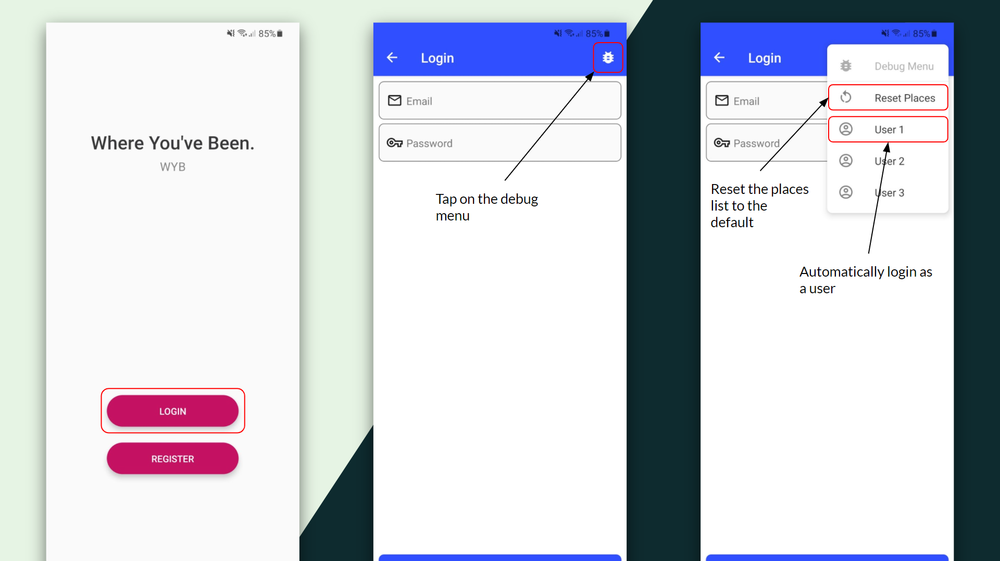

# Where You’ve Been (Demo)

*Where You’ve Been is demonstration app and has no "real" functionality.*



Where You’ve Been is an app for storing, categorising, and rating the places you’ve been. It’s a fun way to check out all the interesting places you’ve visited. In its current implementation, it is designed to be a personal (done-)list and not shared amongst others.

## Project Background

This was my first project with react/react-native, the app was created for a university project over a rather short period of time. That is also why the commit history is not a detailed as I'd usually like. I intentionally did not use libraries such as react-native-redux as the intention was for us to create our own `DataStore` for sharing global state.

The app has a set of built in user accounts, the first two have pre-populated "places" lists, there is also a [debug menu](#usage) so you can avoid logging in and easily switch between users.
* user: `sarah@mail.com` pass: `1234`
* user: `katie@mail.com` pass: `1234`
* user: `justin@mail.com` pass: `1234`

## Screen Designs

The screen designs are available on [figma.com](https://www.figma.com/file/xiiCuLyc5Uw4Fz8Wos8T2n/Where-You've-Been-(App)) (recommended) and also in PDF form [here](examples). The designs were created using Figma and also support their semi-interactive viewing mode.

## Installation


**From Source** (Web/Android/iOS)
```
npm install
npm start
```

**Android APK** (Android)

* You can download the Android APK from the releases ([download](https://github.com/jcwillox/WYB/releases/latest/download/WYB.apk)), and install the app directly to your android device.

**Expo** (Android)

* The published expo application is available at [expo.io/@jcwillox/WYB](https://expo.io/@jcwillox/WYB).

**iOS Simulator** (iOS)

* A package for the iOS simulator is available from the releases ([download](https://github.com/jcwillox/WYB/releases/latest/download/WYB-simulator.tar.gz)), note that this has not been tested.

## Usage

You can use the debug menu to avoid having to log in to the built-in users and to easily switch between them. It can also be used to reset the places list to the default. It is also worth noting that all data aside from the built-in data is ephemeral and will be lost when the app is closed.



---

## Credits
* All images are from [unsplash.com](https://unsplash.com) a fantastic site for beautiful royalty free images.
* [React Native Paper](https://reactnativepaper.com) the driving force behind the UI.
